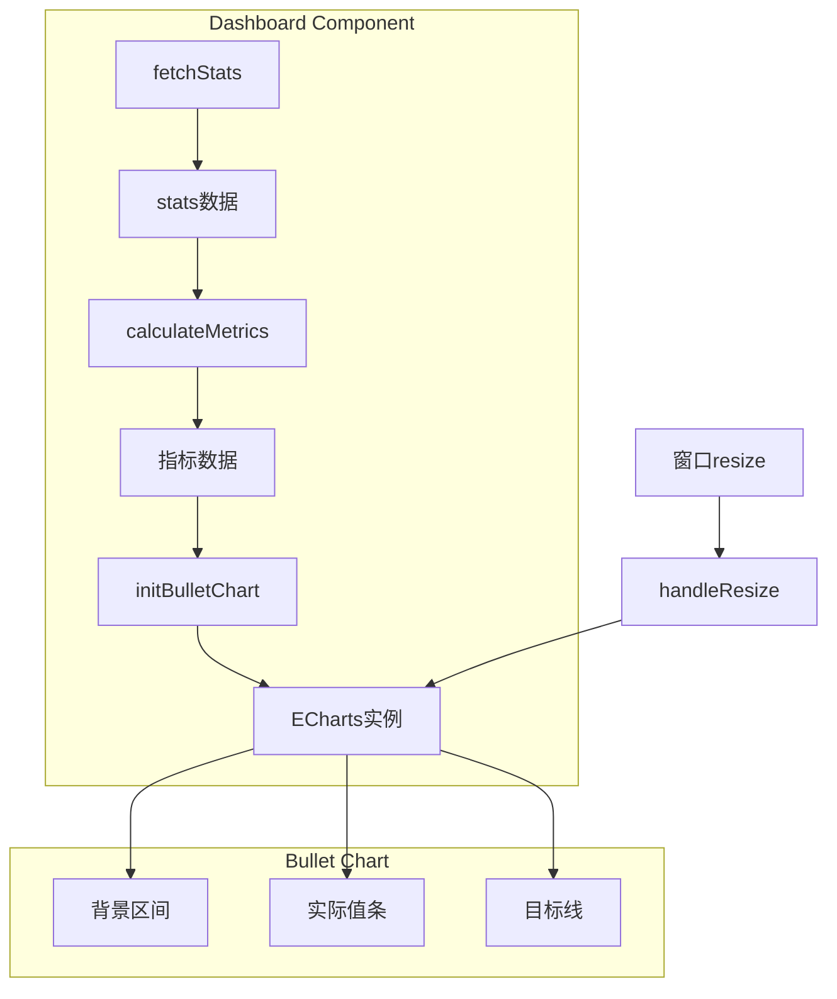

# Design Document: Dashboard Bullet Chart

## Overview

本设计为数据看板添加子弹图（Bullet Chart）组件，使用 ECharts 实现。子弹图将展示设施完好率和审核通过率两个关键指标，通过实际值条、目标线和背景区间的组合，让用户直观了解指标达成情况。

## Architecture

子弹图功能作为 Dashboard 组件的扩展，复用现有的 ECharts 基础设施和数据获取机制。



## Components and Interfaces

### 新增组件

#### 1. 子弹图容器 (Template)
```html
<el-col :span="12">
  <el-card class="chart-card">
    <div ref="bulletChartRef" class="chart-container"></div>
  </el-card>
</el-col>
```

#### 2. 指标计算函数
```typescript
interface DashboardStats {
  total: number
  normal: number
  damaged: number
  pending: number
}

interface BulletMetric {
  name: string           // 指标名称
  actual: number         // 实际值 (0-100)
  target: number         // 目标值 (0-100)
}

function calculateMetrics(stats: DashboardStats): BulletMetric[]
```

#### 3. 颜色选择函数
```typescript
function getBarColor(actual: number, target: number): string
// 返回 '#67C23A' (达标) 或 '#E6A23C' (未达标)
```

#### 4. 子弹图配置生成函数
```typescript
function getBulletChartOption(metrics: BulletMetric[]): EChartsOption
```

### 修改现有组件

- `Dashboard.vue`: 添加子弹图相关的 ref、初始化函数、resize 处理和销毁逻辑

## Data Models

### 指标数据模型
```typescript
interface BulletMetric {
  name: string      // 指标名称，如 "设施完好率"
  actual: number    // 实际百分比值 (0-100)
  target: number    // 目标百分比值 (0-100)
}
```

### 子弹图配置结构
```typescript
// ECharts 子弹图使用自定义系列实现
interface BulletChartConfig {
  title: { text: string }
  tooltip: { formatter: Function }
  xAxis: { max: 100 }
  yAxis: { data: string[] }
  series: [
    { type: 'bar', data: number[] },      // 背景区间-差
    { type: 'bar', data: number[] },      // 背景区间-中
    { type: 'bar', data: number[] },      // 背景区间-良
    { type: 'bar', data: number[] },      // 实际值条
    { type: 'scatter', data: number[] }   // 目标线
  ]
}
```

## Correctness Properties

*A property is a characteristic or behavior that should hold true across all valid executions of a system-essentially, a formal statement about what the system should do. Properties serve as the bridge between human-readable specifications and machine-verifiable correctness guarantees.*

### Property 1: 子弹图配置包含必要视觉元素
*For any* 有效的指标数据数组，生成的子弹图配置 SHALL 包含背景区间系列、实际值条系列和目标线系列三种类型的 series 配置
**Validates: Requirements 1.3**

### Property 2: 颜色选择逻辑正确性
*For any* 实际值和目标值的组合，当实际值 >= 目标值时，getBarColor 函数 SHALL 返回绿色 '#67C23A'；当实际值 < 目标值时，SHALL 返回橙色 '#E6A23C'
**Validates: Requirements 2.1, 2.2**

### Property 3: 百分比格式化正确性
*For any* 0-100 范围内的数值，格式化函数 SHALL 返回带有 '%' 后缀的字符串表示
**Validates: Requirements 3.2**

### Property 4: 指标计算正确性
*For any* 有效的统计数据（total > 0），calculateMetrics 函数 SHALL 返回正确的完好率（normal/total * 100）和通过率计算结果
**Validates: Requirements 5.2**

## Error Handling

| 场景 | 处理方式 |
|------|----------|
| stats.total 为 0 | 设置完好率和通过率为 0，避免除零错误 |
| ECharts 初始化失败 | 捕获异常并在控制台输出错误日志 |
| DOM 元素不存在 | 在初始化前检查 ref 是否有效 |
| 组件卸载时图表未初始化 | 使用可选链操作符安全调用 dispose |

## Testing Strategy

### 单元测试
使用 Vitest 进行单元测试：
- 测试 `getBarColor` 函数的颜色选择逻辑
- 测试 `calculateMetrics` 函数的指标计算
- 测试百分比格式化函数

### 属性测试
使用 fast-check 进行属性测试：
- 验证颜色选择逻辑对所有输入的正确性
- 验证指标计算对各种统计数据组合的正确性
- 验证格式化函数对所有有效数值的正确性

### 测试配置
- 每个属性测试运行最少 100 次迭代
- 测试文件使用 `.test.js` 后缀
- 属性测试需标注对应的 correctness property 编号
