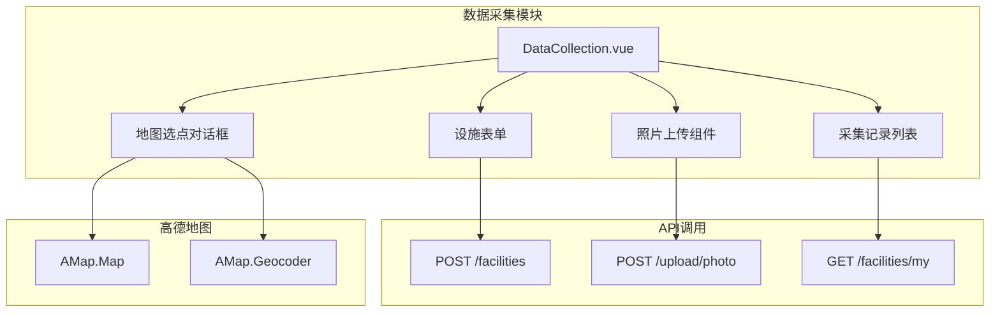

# Design Document: Facility Data Collection

## Overview

本设计为消防设施管理系统添加数据采集上传模块，包含新增设施表单页面和采集记录页面。数据采集员可以通过表单录入设施信息、使用地图选点获取经纬度、上传现场照片，提交后数据进入待审核状态。

## Architecture



## Components and Interfaces

### 新增页面组件

#### 1. DataCollection.vue - 数据采集主页面
```vue
<template>
  <!-- 新增设施表单 -->
  <!-- 地图选点对话框 -->
  <!-- 采集记录列表 -->
</template>
```

### 表单数据模型
```typescript
interface FacilityForm {
  facilityName: string      // 设施名称
  facilityType: number      // 设施类型: 1-消防栓, 2-消防车
  address: string           // 地址
  longitude: number         // 经度
  latitude: number          // 纬度
  status: number            // 状态: 1-正常, 2-损坏, 3-维修中
  pressure: number          // 工作压力(MPa)
  photos: string[]          // 照片URL列表
}
```

### 验证函数接口
```typescript
// 验证文件大小是否超过限制
function validateFileSize(fileSize: number, maxSize: number): boolean

// 验证照片数量是否超过限制
function validatePhotoCount(currentCount: number, maxCount: number): boolean

// 验证表单必填字段
function validateRequiredFields(form: FacilityForm): { valid: boolean, errors: string[] }
```

### 路由配置
```javascript
{
  path: '/collection',
  name: 'DataCollection',
  component: () => import('@/views/DataCollection.vue'),
  meta: { title: '数据采集' }
}
```

## Data Models

### 设施表单数据
```typescript
interface FacilityForm {
  facilityName: string
  facilityType: number | null
  address: string
  longitude: number | null
  latitude: number | null
  status: number | null
  pressure: number | null
}
```

### 照片数据
```typescript
interface PhotoItem {
  uid: string
  url: string
  name: string
}
```

### 采集记录数据
```typescript
interface CollectionRecord {
  facilityId: number
  facilityName: string
  facilityType: number
  address: string
  status: number
  auditStatus: number      // 0-待审核, 1-已通过, 2-已驳回
  rejectReason?: string    // 驳回原因
  createTime: string
}
```

## Correctness Properties

*A property is a characteristic or behavior that should hold true across all valid executions of a system-essentially, a formal statement about what the system should do. Properties serve as the bridge between human-readable specifications and machine-verifiable correctness guarantees.*

### Property 1: 文件大小验证正确性
*For any* 文件大小值，当文件大小超过 5MB (5 * 1024 * 1024 bytes) 时，validateFileSize 函数 SHALL 返回 false；否则返回 true
**Validates: Requirements 3.3**

### Property 2: 照片数量验证正确性
*For any* 当前照片数量，当数量达到或超过 5 张时，validatePhotoCount 函数 SHALL 返回 false 表示不能继续上传；否则返回 true
**Validates: Requirements 3.4**

### Property 3: 表单必填字段验证正确性
*For any* 表单数据，当 facilityName、facilityType、address、longitude、latitude、status 任一字段为空时，validateRequiredFields 函数 SHALL 返回 valid=false 并包含对应的错误信息
**Validates: Requirements 4.1**

### Property 4: 用户记录过滤正确性
*For any* 设施记录列表和用户ID，过滤函数 SHALL 只返回属于该用户的记录
**Validates: Requirements 5.1**

## Error Handling

| 场景 | 处理方式 |
|------|----------|
| 文件大小超过限制 | 显示错误提示"图片大小不能超过5MB" |
| 照片数量超过限制 | 禁用上传按钮，显示提示"最多上传5张照片" |
| 必填字段为空 | 表单项显示红色边框和错误提示 |
| 地图加载失败 | 显示错误提示，允许手动输入经纬度 |
| 照片上传失败 | 显示错误提示，允许重新上传 |
| 表单提交失败 | 显示错误提示，保留表单数据 |

## Testing Strategy

### 单元测试
使用 Vitest 进行单元测试：
- 测试 `validateFileSize` 函数的文件大小验证
- 测试 `validatePhotoCount` 函数的数量限制验证
- 测试 `validateRequiredFields` 函数的必填字段验证

### 属性测试
使用 fast-check 进行属性测试：
- 验证文件大小验证对所有输入的正确性
- 验证照片数量验证对各种数量的正确性
- 验证表单验证对各种数据组合的正确性

### 测试配置
- 每个属性测试运行最少 100 次迭代
- 测试文件使用 `.test.js` 后缀
- 属性测试需标注对应的 correctness property 编号
